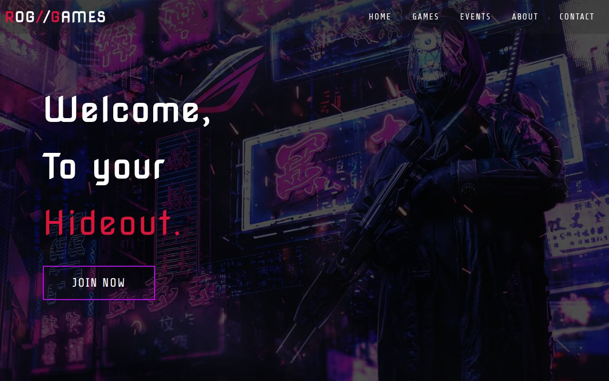
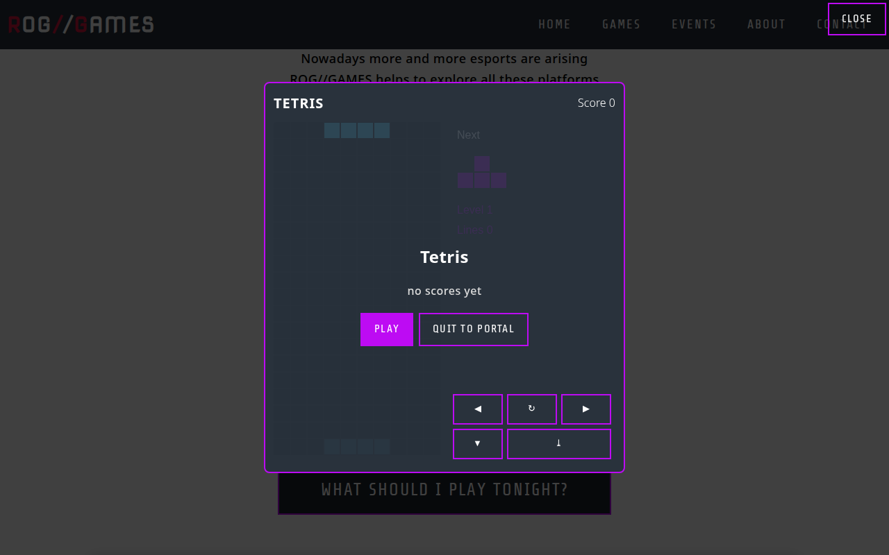
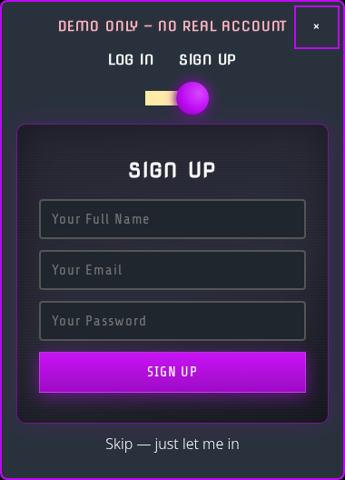

# ROG//GAMES — Hideout v2

A neon arcade hideout: five playable games, a quiz that recommends your next
game, tournament event cards with live countdowns, and a 3D-flip demo login —
all in one static page. No build step, no backend, no request ever leaves the
page's own origin.

**Live:** https://vrdevil44.github.io/Gaming-Portal/



## What's inside

**Games** — five fully playable games, each with its own scene, high-score
tracking (localStorage), and a shared game-shell UI:

| Game | Controls |
|------|----------|
| Snake | Arrow keys / WASD |
| Pong | Mouse or W/S |
| Tetris | Arrows (Up rotates), P pauses |
| Breakout | Mouse or arrows |
| 2048 | Arrow keys |



**Quiz recommender** — answer a few questions and get matched to the game
that fits your mood.

**Events** — Friday tournament cards with live countdown timers and
staggered dates.

**Demo login** — the original 2023 3D-flip card (Log In / Sign Up toggle),
restored and leveled up: self-hosted Nova Square + Share Tech fonts, neon
glow knob, gradient card with scanline texture. Demo only — no real account,
"Skip — just let me in" link included.



## Structure

```
index.html                  page markup (single page)
style.css                   site styles; z-index tokens live on :root
Formstyle.css               legacy modal styles (kept for reference)
app.js                      menu + legacy modal behaviour
js/
  boot.js                   module boot: scenes, nav, modal, quiz, games
  hx.css                    shared game-shell + modal styles
  events/                   events cards + join modal (modal.js, events.css)
  quiz/                     quiz recommender
  games/snake|pong|tetris|breakout/game2048/
                            one folder per game: logic.js + ui.js + style.css
  vendor/                   self-hosted fonts (no CDN calls)
docs/screenshots/           README screenshots
test/                       node:test unit tests per game/quiz
LICENSE
```

Images are WebP (`<name>-480` / `<name>-960` posters, `33-1920` / `33-767`
hero), referenced with relative paths.

### Conventions
- Z-index: only the `--z-*` tokens in `style.css` (`base 0`, `content 10`,
  `header 100`, `menu 200`, `modal 300`, `toast 400`).
- Fonts: self-hosted only (`js/vendor/fonts/`) — zero off-origin requests.
- Modal focus: opening the modal moves focus inside it, Escape closes it,
  focus returns to the trigger.
- `inert` is applied to page sections only — never to an ancestor of the
  modal itself (that kills the modal's own interactivity).

## Run locally

```sh
python3 -m http.server 8000
```

Then open http://localhost:8000/ (use a local server, not `file://` —
ES modules need it).

## Tests

```sh
node --test test/
```

Covers game logic (snake, pong, tetris, breakout, 2048) and the quiz
recommender. UI smoke checks run in Playwright against the local server.

## Dev House pipeline

This repo was rebuilt as "Hideout v2" in scenes by the Dev House pipeline:
Scene 1 (cleanup + assets), Scene 2 (shell + modal), Scenes 3–8 (quiz, snake,
pong, tetris, breakout, 2048). Each scene was spec-frozen, budgeted, built
by a dispatched seat, and verified by Max before merge.
